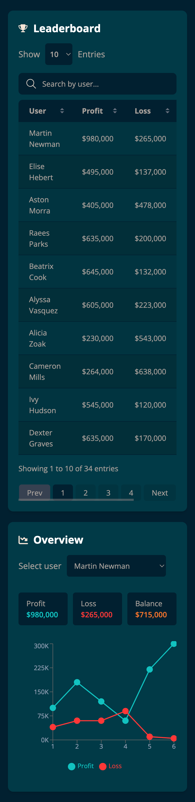
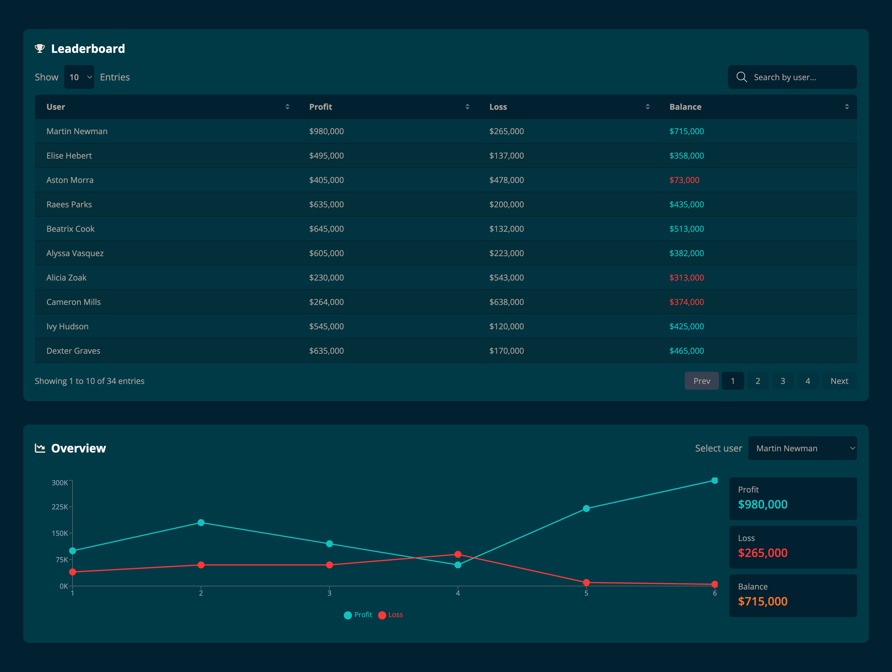

# FPFX Technologies - React Test

## Run the project

1. Clone the repository:

   ```bash
   git clone https://github.com/rafaelleiv/fpfx-react-test.git

    cd fpfx-react-test
   ```

2. Install the dependencies:

   ```bash
   npm install
   ```

3. Start the app and the server concurrently:

   ```bash
    npm run start
   ```
### Eslint and Prettier

The following scripts were added to ensure consistent code quality and formatting throughout the project:

```json

"lint:fix": "eslint 'src/**/*.{ts,tsx,js,jsx}' --fix",
"format": "prettier --write .",
          
lint:fix: Fixes ESLint issues automatically where possible.
format: Uses Prettier to format the entire project according to the .prettierrc configuration.
```
   Advantages
 - Ensures a clean and readable codebase.
 - Prevents common coding errors and maintains consistent formatting across the project.

### Path Aliasing with @
   
    The project uses path aliasing to simplify imports and make the project structure more readable.
    The following aliases are set up in the `tsconfig.json` file:
    
    ```json
    "paths": {
      "@/*": ["src/*"]
    }
    ```

    This configuration allows you to import files from the `src` directory using the `@` prefix. For example:
    
    ```typescript 
   
    import App from '@/App';
    import Button from '@/components/Button';

    ```
### Project Structure
   
    The project structure is organized as follows:
    
    src/
      ├── components/
      │   ├── ui/
      │   │   ├── PaginationButtons.tsx
      │   │   ├── PaginationInfo.tsx
      │   │   ├── PaginationSizeOptions.tsx
      │   │   ├── PanelHeader.tsx
      │   │   ├── SortableTableHeader.tsx
      │   │   ├── SummaryCard.tsx
      │   │   ├── UsersChart.tsx
      │   │   ├── UserSearchInput.tsx
      │   │   ├── UserSelector.tsx
      │   │   ├── UsersTable.tsx
      │   |── LeaderBoard.tsx
      │   │── Overview.tsx
      ├── context/
      │   ├── UserContext.tsx
      │   └── useUserContext.ts
      ├── types/
      │   └── user.ts
      └── App.tsx

Key Components
 - components/ui: Houses reusable UI components like LeaderBoard, UsersChart, PaginationButtons, and PanelHeader.
 - context: Manages global application state (e.g., UserContext for user data).
 - types: Defines TypeScript interfaces, ensuring type safety across the app.

### Suggested Improvements and Optimizations

1. Error Handling: Add error handling mechanisms to provide feedback to users in case of API failures or other issues.
2. Unit Tests: Write unit tests for critical components and functions to ensure code quality and prevent regressions.
3. Accessibility: Improve accessibility by adding ARIA attributes, focus management, and keyboard navigation support.

### App views

1. Mobile View  
   

2. Desktop View  
   

<br>

---

## Task Description

You are required to develop and style a React application using TypeScript. The application should be built with reusable components to ensure modularity and maintainability.

For styling, you may use CSS modules or styled-components. However, TailwindCSS is preferred (not mandatory but recommended).

**Note:** It is necessary to simulate a fake API (JSON file located in the data folder) by running the JSON server. The script to start it can be found in the `package.json` file. The JSON server needs to run concurrently with the application to fetch users.

The task consists of two parts.

### Part 1: Implement Table Functionality

1. **Search by User:**

   - Implement a search functionality allowing users to search for specific entries.

2. **Sorting:**

   - Enable sorting in both ascending and descending order.

3. **Pagination:**

   - Implement pagination to display entries.

4. **Display Entries:**

   - Display entries from 5 to 20, with the default being 10 entries shown.

5. **Current Displayed Entries:**

   - Show the number of entries currently displayed.

6. **Profit and Loss Calculation:**

   - Calculate Profit and Loss shown in the table as the sum of values in the array.

7. **Balance Calculation:**
   - Calculate the balance as (profit - loss). If the balance is positive, use the green color, if negative, use red.

### Part 2: Use Recharts for Chart Implementation

- Use [Recharts](https://recharts.org/en-US/) to implement a chart.
- Retrieve data by selecting any user from the dropdown menu.
- Display profit and loss on the chart obtained from the array.

**Note:** Chart styling is limited, it does not have to be styled like the mockup.
